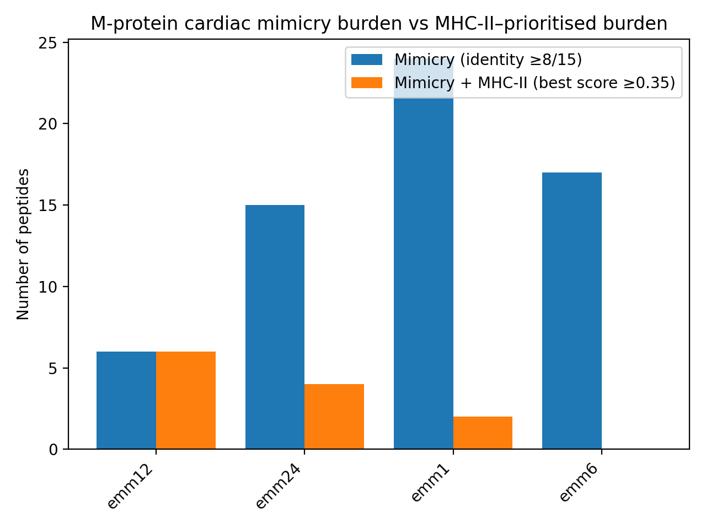
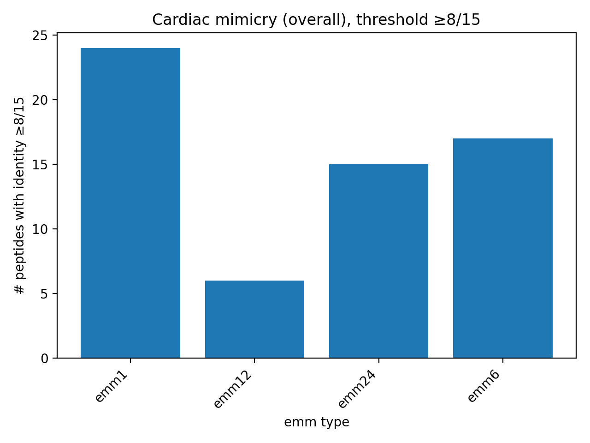

# In-silico Investigation of *Streptococcus pyogenes* M-protein Auto-immunogenicity

## Overview

Acute rheumatic fever (ARF) is a post-infectious autoimmune complication of
*Streptococcus pyogenes* infection, driven by molecular mimicry between bacterial
antigens and human cardiac proteins. In contrast, post-streptococcal
glomerulonephritis (PSGN) is associated with different emm types and tissue
tropism.

This project implements a fully reproducible **in-silico pipeline** to assess
whether **rheumatogenic emm types of the *S. pyogenes* M-protein show enriched
sequence similarity to human cardiac proteins**, compared with PSGN-associated
emm types.

The analysis focuses on biologically relevant regions of the M-protein and
T-cell–relevant peptide lengths, and integrates MHC class II binding prediction
to prioritise immunologically plausible candidates.

---

## Methods

1. **Sequence curation and alignment**
   - M-protein sequences were aligned using MAFFT.
   - Two comparable N-terminal regions were selected:
     - **Region A** – strictly conserved block
     - **Region B** – relaxed coverage block with broader alignment retention

2. **Peptide generation**
   - Overlapping **15-mer peptides** were generated from each region.
   - 15-mers were chosen to reflect typical MHC class II epitope length.

3. **Molecular mimicry scoring**
   - Each M-protein 15-mer was compared against all 15-mers derived from
     human cardiac proteins.
   - A simple identity score (0–15 identical residues) was computed.
   - For each M-protein peptide, the **best matching cardiac peptide** was retained.

4. **Threshold-based analysis**
   - Mimicry was evaluated at similarity thresholds ≥7/15, ≥8/15, and ≥9/15.
   - Hit counts were summarised per emm type and per region.

---

## Key Results

- Mimicry signals were **enriched in rheumatogenic emm types** (emm1, emm6, emm24).
- PSGN-associated **emm12 showed consistently fewer high-identity matches**.
- Differences became most pronounced at **higher similarity thresholds (≥8–9/15)**.
- Region B (relaxed block) showed stronger discrimination than Region A.

These findings are consistent with the hypothesis that **cardiac-directed
autoimmunity in rheumatic fever is driven by selective molecular mimicry**, rather
than nonspecific cross-reactivity.

---

## MHC-II prioritisation (DeepMHCII)

To increase immunological plausibility beyond sequence similarity alone,
high-mimicry peptides were prioritised using **MHC class II binding prediction**.

### Workflow
1. Start from cardiac mimicry candidates (15-mers with identity ≥8/15).
2. Predict MHC-II presentation propensity using a trained **DeepMHCII** model,
   applied to a representative HLA-DRB1 allele panel
   (DRB1_0101, DRB1_0401, DRB1_0701, DRB1_1501).
3. Aggregate predictions across alleles for each peptide
   (e.g. best score and mean score).
4. Rank peptides by mimicry strength and predicted MHC-II score.

### Key outputs

### Outputs

- [results/mimicry_prioritized_mhc2.csv](results/mimicry_prioritized_mhc2.csv)
- [results/deepmhcii/](results/deepmhcii/)

## Visual summary

  

  

---

## Data

### Bacterial sequences
M-protein sequences from six emm types:
- **Rheumatogenic**: emm1, emm3, emm5, emm6, emm24
- **PSGN-associated**: emm12

Sequences were curated to remove signal peptides, focus on the mature
N-terminal portion, and extract homologous regions for comparison.

### Human target proteins
Cardiac proteins implicated in rheumatic heart disease:
- **MYH7** – β-myosin heavy chain
- **TPM1** – tropomyosin α-1 chain
- **ACTC1** – cardiac α-actin

Only human reference sequences (UniProt) were used.

---

## Reproducibility

- All intermediate and final results are written to the `results/` directory.
- The analysis is implemented as a **script-only pipeline** (`scripts/01–04`).
- Separate environments are used for mimicry analysis and DeepMHCII inference.

---

## Documentation

Extended documentation is available in the `docs/` folder:
- [Conceptual overview and biological context](docs/CONCEPTUAL_REPORT.md)
- [Step-by-step technical workflow](docs/TECHNICAL_WORKFLOW.md)

---

## Author

**Krzysztof Giżyński**  
Molecular diagnostics scientist with interests in computational biology,
immunology, and protein-level analysis.
